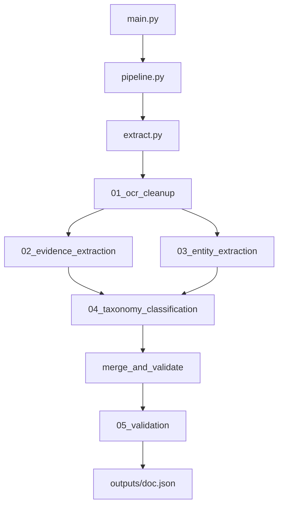

# Smart Document Indexing

MEDFAR take-home prototype: a Python pipeline that processes clinical PDF/fax documents and produces structured JSON for MYLE document indexing.

## Quick start

**Requirements:** Python 3.10+ (stable), OpenAI API key

```bash
cd smart-document-indexing
py -3.10 -m venv .venv
.\.venv\Scripts\pip install -r requirements.txt
copy .env.example .env
# Edit .env and set OPENAI_API_KEY
```

Run on one document:

```bash
.\.venv\Scripts\python main.py "documents\Doc - appointment notice - blank.pdf"
```

Run on all sample documents:

```bash
.\.venv\Scripts\python main.py --all
```

Outputs are written to `outputs/{document_name}.json`.

### Eval dashboard

Inspect each pipeline step (prompt, model output, KPIs) in a browser UI:

```bash
.\.venv\Scripts\streamlit run eval/app.py
```

Use the sidebar to pick a document, then click through each step in the UI:
1. **Extract PDF text** (local, no API)
2. **Run step 1–5** one at a time — prompt preview, output, and KPIs appear in the browser after each step
3. Or use **Run all remaining steps** in the sidebar to finish in one go

Gold labels live in `eval/labels/`.

Batch evaluation across all sample PDFs:

```bash
.\.venv\Scripts\python eval/run_eval.py
```

### Optional: Tesseract OCR

For image-only PDFs (e.g. prescription form), install [Tesseract OCR](https://github.com/UB-Mannheim/tesseract/wiki) and add it to your PATH. If Tesseract is unavailable, the pipeline falls back to GPT-4o vision transcription (uses additional API calls).

## Architecture



Prompts do **not** call each other. `pipeline.py` orchestrates the chain and passes each step's output as input to the next.

| Step | Purpose |
|------|---------|
| 1. OCR cleanup | Clean fax/OCR noise while preserving clinical facts |
| 2. Evidence extraction | Extract clues only — no classification yet |
| 3. Entity extraction | Patient identifiers and physicians (no EMR matching) |
| 4. Taxonomy classification | Map to MYLE class/subclass + routing text |
| 5. Validation | Check output against document; flag review |

## Why prompt chaining?

A single mega-prompt tends to hallucinate patient data and misclassify ambiguous documents. Separating steps:

- **Evidence before classification** grounds taxonomy decisions in explicit document clues
- **Entity extraction** is isolated so identifiers are not invented during classification
- **Validation** acts as a final safety check before output is saved

## Output schema

Each document produces JSON with:

- `document_class` / `document_subclass` (MYLE taxonomy)
- `classification_confidence`
- `short_description`
- `patient_identifiers` (name, DOB, health card, etc.)
- `physicians` (name, role, confidence, evidence)
- `routing_support_text` — concise summary for semantic routing rules
- `ambiguities` — unclear or missing information
- `human_review_required` — flag for manual indexing
- `pipeline_status` — `pass`, `pass_with_review`, or `fail`
- `blocking_errors` — deterministic failures (invalid taxonomy, hallucinated fields, LLM invalid)
- `warnings` — non-blocking issues (low confidence, placeholder physicians, evidence mismatches)
- `validation_notes` — supplementary LLM review notes
- `source_evidence` — clues used for classification

## How ambiguity is handled

- Entity step returns `null` for missing patient fields and adds entries to `ambiguities`
- Classification step can return `alternative_classifications` and lower confidence
- Acceptable ambiguity (e.g. Clinical Note vs Consultation Reports for a specialist note) is captured with lower confidence rather than forced wrong answers
- Mixed-document PDFs (e.g. referral declined + medication form) are flagged for human review

## When `human_review_required` is true

The flag is set when **any** of these apply:

- Classification confidence &lt; 0.6
- Invalid MYLE class/subclass pair (Python-side taxonomy check)
- Evidence suggests multiple document types in one PDF
- Classification step sets the flag (e.g. mixed pages)
- Validation step recommends review or marks output invalid

## Semantic routing

`routing_support_text` is a short, factual summary designed for routing rules in MYLE — e.g. *"Specialist appointment notice for referred patient, consultation on Apr 29 2026"*. Combined with class/subclass and physician roles, this supports automated routing to the correct clinician inbox without EMR patient matching.

## Sample documents and expected classifications

| Document | Expected class | Expected subclass | Notes |
|----------|---------------|-------------------|-------|
| Résultat - Laboratoire | Results | Laboratory | Scanned; OCR/vision may apply |
| imaging | Results | Imaging | |
| consultation report | Clinical Note or Consultation Reports | Specialist | Either class acceptable |
| prescription | Medication and Prescriptions | Prescription Form | Image-only PDF |
| appointment notice | Other | Patient Services | |
| referral declined | Mixed | Mixed | **Should flag human review** |

## What was discarded

- EMR patient matching (explicitly out of scope)
- Production-grade OCR pipeline
- Web UI / REST API
- Fine-tuned classifiers
- Full benchmark evaluation suite
- Page-level split indexing (noted as future work)

## Limitations

- Prototype only — not production OCR quality
- Evaluated on 6 provided samples, not a golden dataset
- English/French mixed content; no dedicated bilingual handling
- 5 LLM calls per document (cost/latency)
- Image-only PDFs require Tesseract or GPT-4o vision fallback
- Single class/subclass per document (mixed PDFs get one best-fit + review flag)

## Roadmap (next steps)

| Phase | Status | Description |
|-------|--------|-------------|
| Core pipeline | Done | 5-step chain, CLI, JSON output |
| Mini eval labels | Next | Create `eval/labels/` from sample expectations |
| Eval harness | Planned | Per-prompt metrics (recall, classification accuracy, review flag precision) |
| Page-level classification | Planned | Split multi-document PDFs per page |
| Model comparison | Planned | Same prompts on GPT-4o, Gemini, Claude |
| Benchmark dataset | Planned | 200+ labeled documents across MYLE classes and OCR quality tiers |

### How evaluation could be added

1. Add `eval/labels/{document_id}.json` with expected class, subclass, key fields, and `human_review_required`
2. Add `eval/run_eval.py` to run the pipeline and compare outputs
3. Track per-step metrics: evidence recall, entity field accuracy, classification top-1, validation precision
4. Use results to A/B test prompt versions

## Project structure

```
smart-document-indexing/
  documents/          # Sample PDFs
  prompts/            # 01–05 markdown prompt templates
  outputs/            # Generated JSON (gitignored)
  eval/               # Eval dashboard, scorer, gold labels
    app.py            # Streamlit UI
    run_eval.py       # Batch test report
    scorer.py         # Per-step KPI calculations
    labels/           # Expected outputs per sample PDF
  extract.py          # PDF text extraction
  schema.py           # Pydantic models + MYLE taxonomy
  llm_client.py       # OpenAI client
  pipeline.py         # Pipeline orchestration
  main.py             # CLI entrypoint
  requirements.txt
  .env.example
  README.md
```

## LLM configuration

Default model: `gpt-4o` (configurable via `OPENAI_MODEL` in `.env`).

Gemini and Claude could be evaluated using the same prompt templates and a swapped `llm_client.py` implementation.
